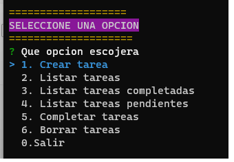
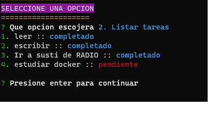
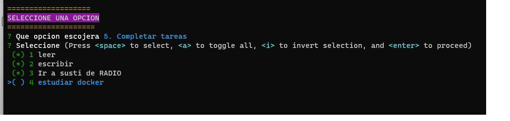
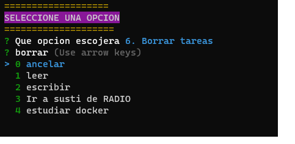

## PLANTILLA USADA
-[PLANTILLA USADA](#https://github.com/EL-BID/Plantilla-de-repositorio/blob/master/README.md)
-https://github.com/EL-BID/Plantilla-de-repositorio/blob/master/README.md
## DOCUMENTACIÓN README.md
Se pondrá toda la documentación, acerca de este capítulo
## OJO
---
Una vez descargado el archivo de GitHub se debe ejecutar el sgte comando
```js
npm install 
```
---
## A LA HORA DE SUBIR UN PROYECTO CONSIDEREMOS

<p align="center">Crear tarea</p>
<p align="center"></p>
<p align="center">Listar Tareas</p>
<p align="center"></p>
<p align="center">Completar tarea</p>
<p align="center"></p>
<p align="center">Borrar Tarea</p>
<p align="center"></p>

## OBSERVACIÓN
AL INICIAR UN PROYECTO ESCRIBIR 
```
npm init -y
```
## OBSERVACION para leer DATOS
```js
const readline = require('node:readline');
const { stdin: input, stdout: output } = require('node:process');

const rl = readline.createInterface({ input, output });

rl.question('What do you think of Node.js? ', (answer) => {
  // TODO: Log the answer in a database
  console.log(`Thank you for your valuable feedback: ${answer}`);

  rl.close();
});
```

## A LA HORA DE SUBIR A GITHUB TENER EN CUENTA

```
EN .gitignore PONER node_modules/
```

## TRABAJAMOS CON EL PAQUETE INQUIRER PARA HACER MENUS INTERACTIVOS
---
- [PAQUETE INQUIRER](#https://www.npmjs.com/package/inquirer)
- [PAQUETE UUID](#)
- [PAQUETE CHALK](#)
- [PAQUETE COLORS](#)
